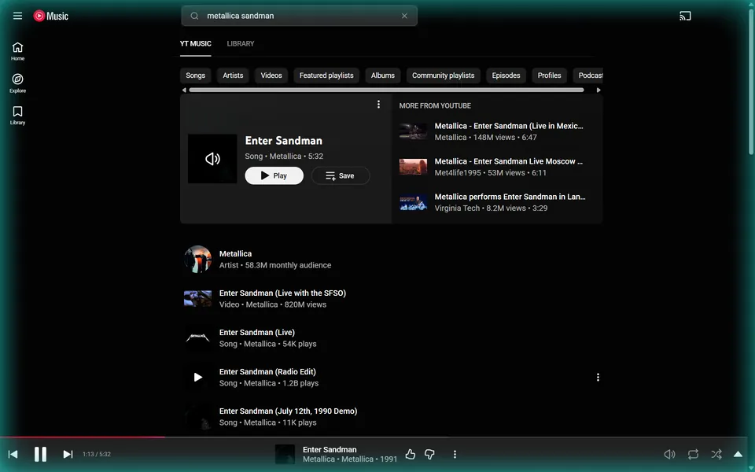

# BeatFrame



BeatFrame lights the edges of your screen to the drums in whatever your PC
is playing. It picks the kick, the snare and the hi-hat out of the sound, and
each one moves the light in its own way. It runs from the tray on Windows.

What each version brought is on the
[releases page](https://github.com/ard0x10/beatframe/releases).

## What it does

- Listens to the sound Windows is playing, from any app: a music player, a
  browser tab, a game. It does not use the microphone.
- Five themes:
  - Band: a solid strip round the edge with a soft glow inside, in two colors
    the music turns round the frame.
  - Layered: every drum lights the whole edge, in layers.
  - Split: kick lights the bottom, snare the sides, hi-hat the top.
  - Ripple: each kick sends a wave up from the bottom middle.
  - Aurora: a slow curtain of light flows along the frame; the drums only nudge it.
- Each theme keeps its own thickness, brightness, fade and glow between hits,
  and its own choice of which drums it answers and how strongly.
- Three palettes (jade, ice, violet), two colors of your own, or colors taken
  from the cover of the song playing, when the player shares it with Windows.
- Clicks go through the light. It never takes the focus and does not show up
  in Alt+Tab.
- Draws on the main display, or on any other monitors you check in the
  settings window. Each monitor gets its own frame.
- Can hide itself while a game or a video is full screen, only on the monitor
  it covers.
- Written in Rust and light on resources: it draws only while sound plays
  and sleeps when the sound stops. A lower frame rate (30 or 40 fps) uses
  less of the graphics card.

## Requirements

Windows 10 or 11 and a graphics card with DirectX 12. So far it has been
tested on Windows 11 only.

## Build from source

You need Rust 1.95 or newer with the MSVC toolchain (it comes with the Visual
Studio Build Tools).

```
git clone https://github.com/ard0x10/beatframe
cd beatframe
cargo build --release
```

The program is `target\release\beatframe.exe`. Run it and it appears in the
tray.

### A Start Menu shortcut

After the build:

```
powershell -ExecutionPolicy Bypass -File scripts\install-shortcut.ps1
```

This puts BeatFrame in the Start Menu and on the Desktop, with its icon. The
shortcut opens the exe in `target\release`, so keep the folder where it is.
Adding `-Remove` to the same command takes the shortcuts away again.

## Using it

The tray icon has three entries: **On** switches the light on and off,
**Settings…** opens the settings window, **Quit** closes BeatFrame.
Starting BeatFrame again while it runs opens the settings window too.

Ctrl+Alt+Shift+L switches the light from any app. The keys can be changed or
cleared in the settings window.

## Settings

The settings window applies each change as you make it and shows a small
preview of the theme. Everything it sets is kept in a plain text file,
`%APPDATA%\beatframe\settings.toml`, written with comments the first time
BeatFrame runs. The file can be edited by hand too; changes apply as soon as
it is saved.

| Setting | Values | Default |
|---|---|---|
| `enabled` | `true`, `false` | `true` |
| `toggle_key` | keys like `"ctrl+alt+shift+l"`, `""` for none | `"ctrl+alt+shift+l"` |
| `start_with_windows` | `true`, `false` | `false` |
| `theme` | `band`, `layered`, `split`, `ripple`, `aurora` | `band` |
| `palette` | `jade`, `ice`, `violet`, `custom` | `jade` |
| `custom_base`, `custom_accent` | colors like `"#10b8a0"` | jade's two colors |
| `album_colors` | `true`, `false` | `false` |
| `fps` | `30`, `40`, `60` | `60` |
| `layout` | `strips` (along the edges), `full` (one window over the screen) | `strips` |
| `monitors` | `"primary"` for the main display, other monitors by the names the settings window lists | `["primary"]` |
| `pause_on_fullscreen` | `true`, `false` | `false` |

Each theme has its own table, `[layered]`, `[split]` and so on, with these
values:

| Setting | Values | Default |
|---|---|---|
| `thickness` | `0.5` to `2.0` | `1.0` |
| `brightness` | `0.2` to `2.0` | `1.0` |
| `kick`, `snare`, `hat` | `true`, `false` | `true` |
| `kick_strength`, `snare_strength`, `hat_strength` | `0` to `2` | `1.0` |
| `fade` | `0.3` to `3.0`, smaller is sharper | `1.0` |
| `resting` | `0` to `2`, the glow between hits | `1.0` |

And some that only one theme has:

| Setting | Values | Default |
|---|---|---|
| `[layered] shimmer` | `0` to `2` | `1.0` |
| `[ripple] wave_seconds` | `0.3` to `2.0` | `0.8` |
| `[ripple] tail` | `0.2` to `3.0` | `1.0` |
| `[ripple] sparks` | `0` to `2` | `1.0` |
| `[aurora] flow` | `0.2` to `3.0` | `1.0` |
| `[aurora] folds` | `0.5` to `2.0` | `1.0` |
| `[band] spin` | `0` to `3`, `0` keeps the colors still | `1.0` |
| `[band] waves` | `0` to `2`, `0` keeps the inner edge straight | `1.0` |
| `[band] corners` | `0` (square) to `1` (roundest) | `0.35` |

## How it works

BeatFrame records what Windows sends to the default output device (WASAPI
loopback). The sound is cut into short overlapping windows, 2048 samples long
with a new one every 512 (about 11 ms at 48 kHz), and each window is turned
into a spectrum. Three bands are watched: 40 to 120 Hz for the kick, 150 to
250 Hz plus 1.5 to 5 kHz for the snare, and 6 to 16 kHz for the hi-hat. A hit
is a sudden rise of energy in a band above a threshold that follows the last
half second of the song, so a loud track and a quiet one both trigger. Each
hit goes to the theme, which draws it on the GPU with wgpu (DirectX 12) in
transparent windows along the screen edges.

## Limitations

- Windows only.

## License

BeatFrame is released under the MIT license, see [LICENSE](LICENSE). The
open source packages it is built on and their licenses are listed in
[THIRD-PARTY-LICENSES.txt](THIRD-PARTY-LICENSES.txt).
